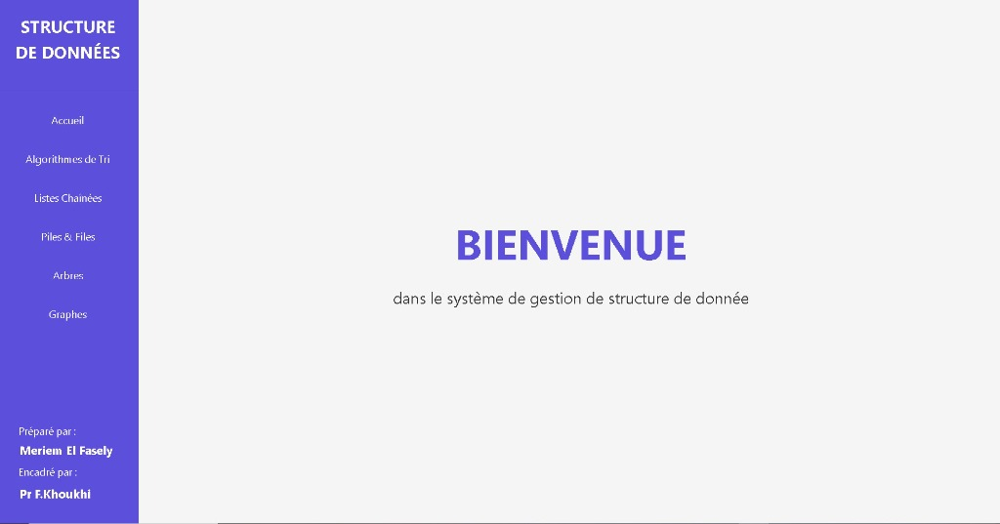
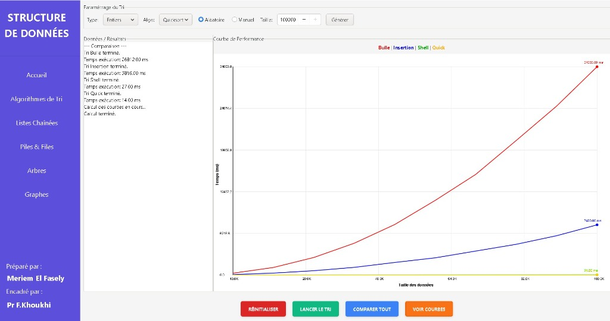
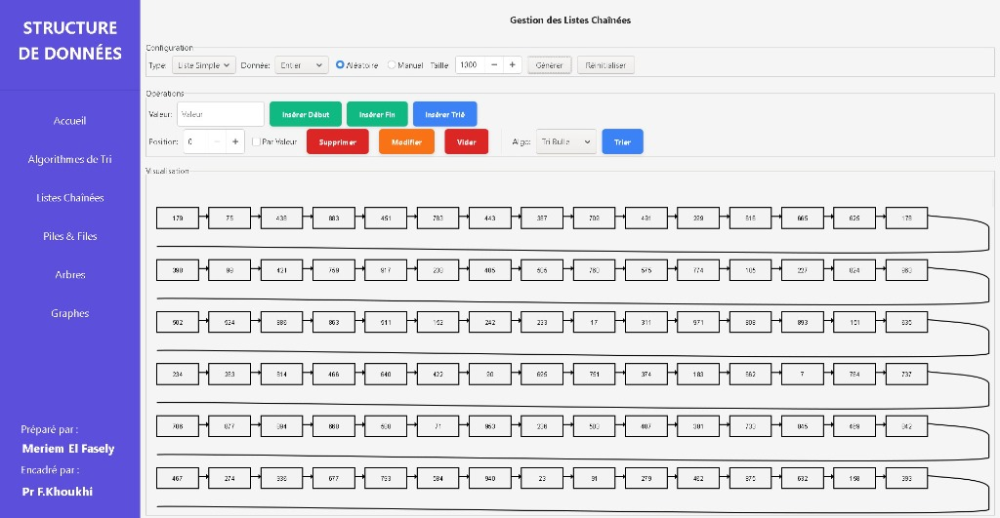
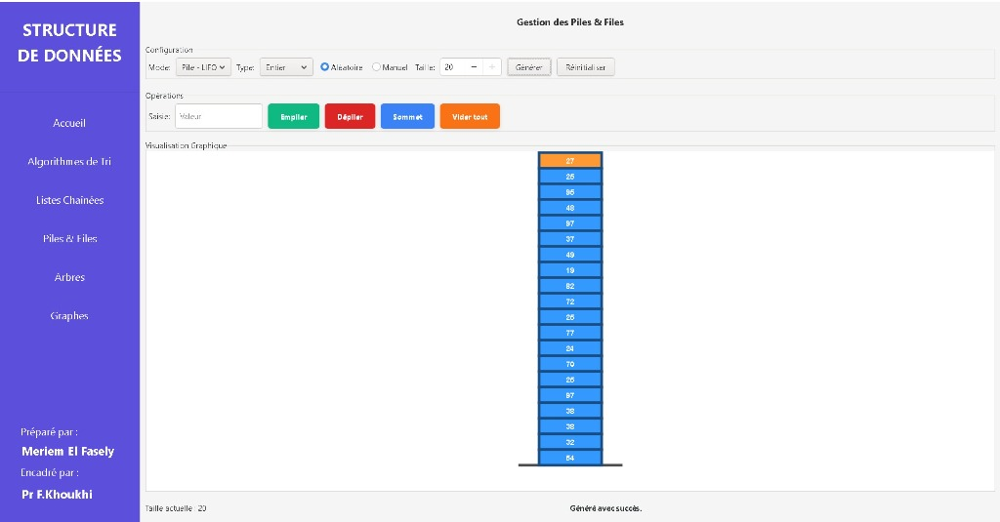
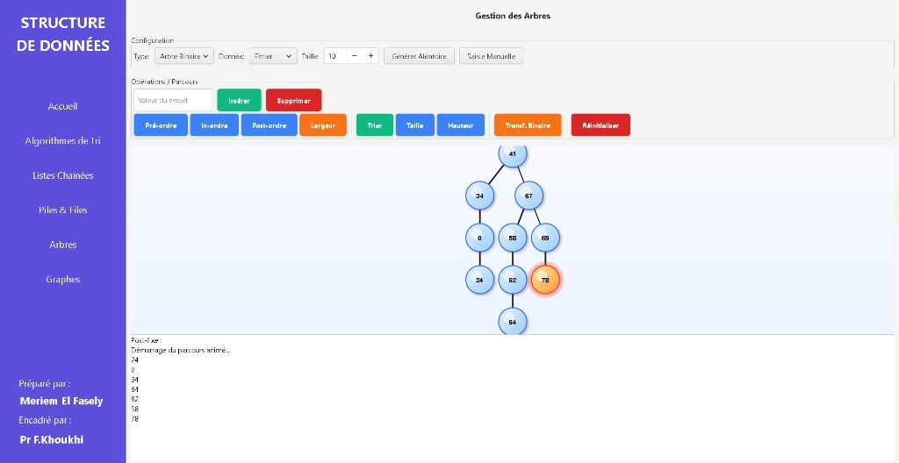
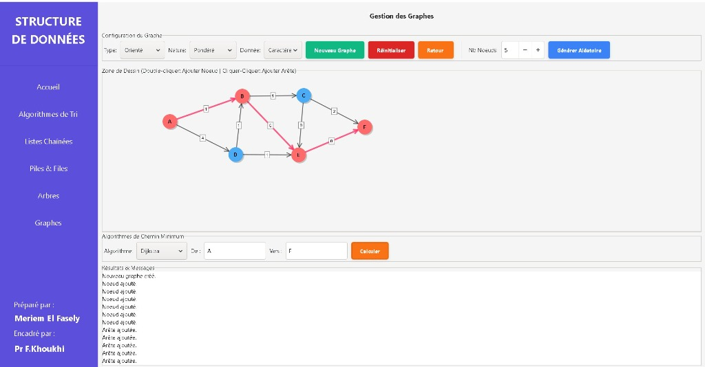

# Mini Système de Gestion des Structures de Données





## Description
**Data Structures Interactive Lab 🧪**

Ce projet est une application interactive développée en **C** avec l'interface graphique **GTK3**. Elle permet de visualiser et de manipuler en temps réel les structures de données fondamentales de l'informatique.

L'objectif est d'offrir une plateforme éducative et visuelle pour comprendre le fonctionnement interne des algorithmes.


## Fonctionnalités Principales

Le système comprend 5 modules majeurs, chacun illustré ci-dessous :

### 1. ⚡ Algorithmes de Tri (Sorting)
Comparaison visuelle et temporelle de différents algorithmes de tri (Bulle, Insertion, Rapide, etc.).


### 2. 🔗 Listes Chaînées (Linked Lists)
Insertion, suppression, tri et visualisation des pointeurs.


### 3. 📚 Piles & Files (Stacks & Queues)
Démonstration des principes LIFO et FIFO avec animations graphiques.


### 4. 🌲 Arbres (Trees)
Visualisation d'arbres binaires, parcours (prefixe, infixe, postfixe) et manipulation dynamique.


### 5. 🕸️ Graphes (Graphs)
Création de nœuds et d'arêtes, algorithmes de plus court chemin (Dijkstra, etc.) et visualisation graphique.


## Technologies Utilisées

*   **Langage** : C
*   **Interface Graphique** : GTK+ 3.0
*   **Compilation** : Makefile / GCC

## Installation et Utilisation

### Prérequis
*   GCC (GNU Compiler Collection)
*   Bibliothèque GTK+ 3.0 (`libgtk-3-dev`)
*   Sur Windows, il est recommandé d'utiliser **MSYS2** pour installer GTK3.

### Compilation
Pour compiler le projet, utilisez simplement la commande `make` à la racine :

```bash
make
```

### Exécution
Lancez l'executable généré :

```bash
./main
```

## 📥 Téléchargement

Vous avez deux options pour obtenir le projet :

### Option 1 : Via Git (Recommandé)
Ouvrez votre terminal et exécutez :
```bash
git clone https://github.com/Meriem-El-Fasely/Mini_Systeme_de_Gestion_des_Structures_de_Donnees.git
```

### Option 2 : Télécharger le ZIP
1.  Cliquez sur le bouton vert **Code** en haut de la page GitHub.
2.  Sélectionnez **Download ZIP**.
3.  Extrayez le dossier sur votre ordinateur.

---
*Projet réalisé dans le cadre du module de Structures de Données Avancées (LST_2I).*
